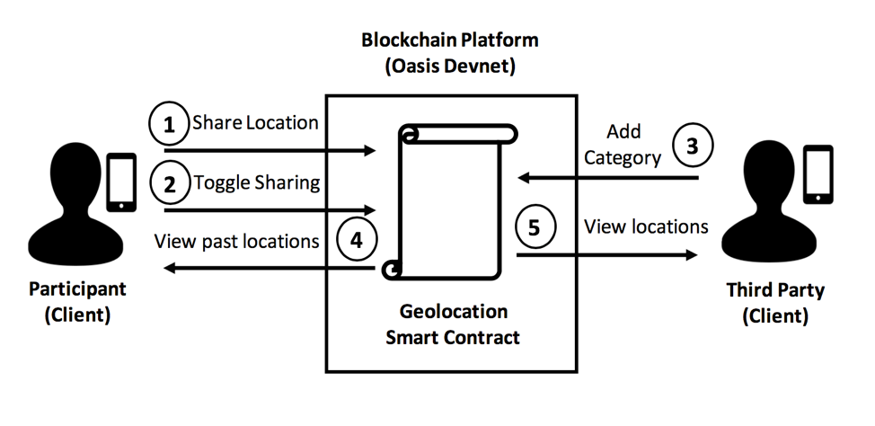

<p align="center">
  
</p>

# 🏥 Biomedical Data Sharing dApp - Geolocation 📍
[](https://developer.apple.com/swift/)


[](https://appetize.io/app/zt5wb6e9qpu47ejk7k1ezqzv2c?device=iphonex&scale=75&orientation=portrait&osVersion=12.1&deviceColor=black)


A sample iOS dApp that demonstrates a practical use-case in biomedical research: *sharing location data* by interacting with a [smart contract](https://github.com/HD2i/GeolocationSmartContract) via [web3swift](https://github.com/matterinc/web3swift) deployed on the [Oasis Devnet](https://docs.oasiscloud.io/en/latest/). 

---
  * [About](#about)
  * [Requirements](#requirements)
  * [Installation](#installation)
    + [CocoaPods](#cocoapods)
  * [Usage](#usage)
    + [Wallet Creation](#wallet-creation)
    + [Funding the Wallet](#funding-the-wallet)
    + [Participant Tab](#participant-tab)
    + [Third Party Tab](#third-party-tab)
  * [FAQ](#faq)
  * [Future Improvements](#future-improvements)
  * [License](#license)

---

## About

This sample app demonstrates how a research study participant ("Participant") could share useful features of their geolocation data with a research team ("Third Party"), without revealing their raw geocoordinates. Third parties would be able to determine if and when participants have visited particular locations of interest (i.e. Hospital, Pharmacy, or Gym).   

<p align="center">
  
</p>

For the purpose of demonstrating functionalities of both roles (participants and third parties), this app allows you to function as either role by simply switching tabs to change roles. However, in a real-world implementation of this app the user would only have access to the functionalities of their role. 


[Appetize](https://appetize.io/app/zt5wb6e9qpu47ejk7k1ezqzv2c?device=iphonex&scale=75&orientation=portrait&osVersion=12.1&deviceColor=black) : Test the app and interact with a deployed non-confidential version of the smart contract from your web browser. 
*Note: Some buttons and features have been disabled on Appetize as security and privacy precautions.*

## Requirements

- iOS 12.1+ 
- Xcode 10.0+
- Swift 4.2+


## Installation

### CocoaPods

[CocoaPods](http://cocoapods.org) is a dependency manager for Cocoa projects and is used in this project. You can install CocoaPods with the following command:

```bash
$ sudo gem install cocoapods
```
Once installed, you can clone or download this repo. 

Then, run the following command:

```bash
$ pod install
```

## Usage
For the purposes of this demo, both an [instance](https://github.com/HD2i/GeolocationSmartContract) of the confidential smart contract and non-confidential smart contract were deployed on the Oasis DevNet. As web3c is not currently supported by web3swift, the app only interacts with the non-confidential contract. **While the non-confidential implementation is sufficient for the purposes of a working demonstration, it should be stressed that the current non-confidential implementation does not ensure privacy.**  


### Wallet Creation
Upon application launch, you will be presented with two options: creating or importing a new wallet. When creating or importing an existing wallet, you will be prompted to enter a user-generated password. This password is later used to access the wallet's private key and post new data to the smart contract. Once a wallet is either created or imported, you will be presented with a Tab view, consisting of three tabs: *Third Party, Participant,* and *Wallet*. 

### Funding the Wallet
Once created you will first have to add funds to your wallet, which is done within the Wallet tab. The Wallet tab presents you with views and functionalities associated with managing a wallet on a blockchain and is required for both roles. Within this tab you can view your wallet address, add a balance to your wallet, view your private key, and log out- deleting the wallet from your device. The Oasis Devnet uses DEV tokens as the digital currency and will be needed to post new data to the smart contract. To add DEV tokens to your wallet follow the on-screen instructions from the Oasis Devnet faucet, after tapping the **Add Balance** button. 

### Participant Tab
This tab allows you to act as a participant, giving you the ability to post your current location, toggle whether or not you want to share your previously shared location data, and view your previously posted data. 

Within this tab, you are presented with a map showing your location and the coordinates of your location along with the current date and time. If you are running the app in a simulator, you can simulate any location within
 *Debug -> Location -> Custom Location* and entering a custom latitude and longitude. This location and timestamp can be posted to the smart contract by tapping the **Share Location** button. An alert will appear asking for the password you used to create your wallet to confirm that you wish to share your location.
 
You can also toggle whether or not you, as the participant, want to enable third parties to view your previously posted locations. You are also able to view your previously posted location categories and timestamps. 


### Third Party Tab


Within this tab, you can act as a Third Party giving you the ability to post new geolocations of interest with their associated category, view summary statistics of participants, and view more detailed information for each participant. 

To add new geolocations as the Third Party you are able to search for map-based addresses and places of interest, through Apple’s MapKit Framework with geo-encoding service performed by Apple (geo-encoding is only done for the Third Party not the Participant). Once you have selected a location and an associated category, you can post this new location to the smart contract. 

As a Third Party, you are able to view a summary of all participants currently sharing their data. This summary includes the number of participants who’ve posted at least one location, the percentage of participants who have currently enabled sharing, as well as the total number of locations that are available and being shared. For specific information on each Participant, you are presented a table view of all participants identified by a Participant ID and whether or not they are currently sharing their data. If they are sharing their data, you can view how many locations they have shared as well as the features of their data. 


## FAQ
**I want to use a different contract, what changes do I need to make?** 

Other than updating the app to match the needs of the new contract, within the `GeolocationContract.swift` file you would need to replace the `contractAddress` and `geoABI` string with your newly deployed contract address and ABI. Within the  `Web3SwiftService`, you would also need to update the methods to interact with your newly deployed contract.

**What do I need to change to get this to work with a contract deployed on Ethereum?** 

Make sure to note which network you've deployed your smart contract to (i.e. main net, Ropsten, Kovan, Rinkeby). Within Web3swiftService, update the web3instance variable to the correct web3 instance for example, if using Infura's mainnet provider: `Web3.InfuraMainnetWeb3()`. Update the block explorer url to an Etheruem block explorer for your chosen network, such as Etherscan. Within the `GeolocationContract.swift` file, replace the `contractAddress` and `geoABI` string with your contract address and ABI.

## Future Improvements
In an attempt to make the DApp as simple as possible, while still accomplishing the goal of geolocation feature extraction, several concessions were made in the design of both the smart contract and iOS app that leave room for improvement.

### Passive Data Sharing
One of the more obvious areas of improvement, would be in terms of usability. It would be beneficial to allow the Participant the option to passively post location data in the background with a certain frequency and not be burdened with the task of actively requiring to tap a button whenever they wish to post their location. The user interaction would benefit if the data returned from the smart contract were stored as a local copy to the device, especially as the number of users and the number of their locations grow. Similarly, providing a method of exporting the data would also undoubtedly offer benefit to users.

### Access Control  
Another potential improvement could be to add an additional mapping of Third Party address to the Participant ID whose data they have accessed; this would enable a Participant to see the addresses of the Third Parties have accessed their data. Additionally, another mapping of Third Party addresses to identifying names could be added to the smart contract in the event that they do not need to remain pseudo-anonymous or if Participants wish to know who was accessing their data. An additional feature could also be introduced to allow Participants the ability to enable and disable the sharing of specific locations they have previously posted and could potentially be given the ability to ‘whitelist’ or ‘blacklist’ Third Parties from their data.

### Expanded Data Features 
This DApp provides a basic example of extracting a semantic descriptor, such as the location category, from the location data. However, one could easily envision more advanced feature extraction of such geolocation data. Statistical descriptors, such as the total distance traveled in a day, variance in the number of locations visited, and the travel radius of participants could be computed by the smart contract, given that the smart contract were redesigned to store the raw coordinates of the locations.  


## Acknowledgements

We would like to the acknowledge the following projects:

* [web3swift](https://github.com/matterinc/web3swift) by [Matter, Inc.](https://github.com/matterinc)
* [PeepethClient](https://github.com/matterinc/PeepethClient) by [Matter, Inc.](https://github.com/matterinc)
* [Oasis Devnet](https://docs.oasiscloud.io/en/latest/) by [Oasis Labs](https://www.oasislabs.com/)
* [Icons8](https://icons8.com)

## License
This app is available under the MIT license. See the [LICENSE](License) for more details.
