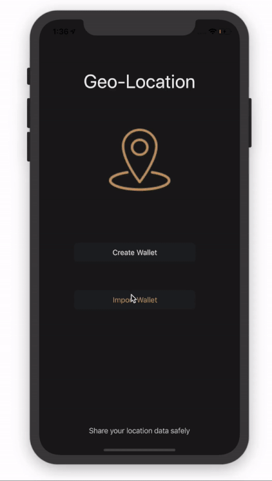

<p align="center">
  
</p>

# 📍GeoLocation 

[](https://developer.apple.com/swift/)

A sample iOS app to demonstrate a practical use-case of geolocation feature extraction that interacts with a [smart contract](https://github.com/HD2i/GeolocationSmartContract) deployed on the [Oasis Devnet](https://docs.oasiscloud.io/en/latest/). More specifically, this app serves as an example of how research participants could provide a semantic descriptor of the location type of their data to researchers or interested 3rd Parties, without having to reveal identifiable personal information such as the coordinates of their exact locations. 


To test the app and interact with a deployed non-confidential version of the smart contract: [Appetize](https://appetize.io/app/zt5wb6e9qpu47ejk7k1ezqzv2c?device=iphonex&scale=75&orientation=portrait&osVersion=12.1&deviceColor=black) 
* *Note: Importing a wallet has been disabled on Appetize. As a result, you can only view Participants.*

---


  * [Requirements](#requirements)
  * [Installation](#installation)
    + [CocoaPods](#cocoapods)
  * [License](#license)

---

## Requirements

- iOS 12.1+ 
- Xcode 10.0+
- Swift 4.2+


## Installation

### CocoaPods

[CocoaPods](http://cocoapods.org) is a dependency manager for Cocoa projects and is used in this project. You can install CocoaPods with the following command:

```bash
$ sudo gem install cocoapods
```
Once installed, you can clone or download this repo. 

Then, run the following command:

```bash
$ pod install
```


## Acknowledgements

We would like to the acknowledge the following projects:

* [web3swift](https://github.com/matterinc/web3swift) by [Matter, Inc.](https://github.com/matterinc)
* [PeepethClient](https://github.com/matterinc/PeepethClient) by [Matter, Inc.](https://github.com/matterinc)
* [Oasis Devnet](https://docs.oasiscloud.io/en/latest/) by [Oasis Labs](https://www.oasislabs.com/)
* [Icons8](https://icons8.com)

## License

